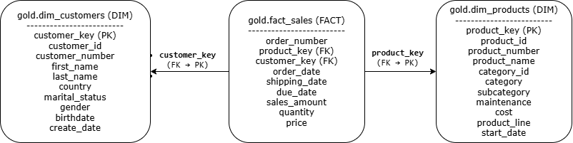

# 📊 SQL Data Analytics Project

## 📖 Overview
This project focuses on analyzing sales data using SQL to solve key business problems related to customers and products.  
It transforms raw transactional data into structured insights that support decision-making.

The project is built on a star schema data model with fact and dimension tables.

---

## 📊 Data Model

This diagram shows the data model used for the analysis, where a central fact table (sales) is connected to customer and product dimension tables.

---

## 📌 Project Components

### 🔹 1. Customer Report
A customer-level analytics report designed to understand customer behavior and value.

**Key Features:**
- Customer Segmentation → VIP, Regular, New  
- Age Group Classification  
- Metrics → Total Orders, Sales, Quantity, Products  
- Recency Analysis (months since last purchase)  
- KPIs → Average Order Value, Monthly Spend  

---

### 🔹 2. Product Report
A product-level analytics report focused on performance and revenue patterns.

**Key Features:**
- Product Segmentation → High Performer, Mid Range, Low Performer  
- Metrics → Total Orders, Sales, Quantity, Unique Customers  
- Product Lifespan Analysis  
- Recency (months since last sale)  
- KPIs → Average Selling Price, Order Revenue, Monthly Revenue  

---

## 🛠️ Tools & Concepts Used
- SQL Server  
- Joins (Fact & Dimension tables)  
- CTEs (Common Table Expressions)  
- Aggregations (SUM, COUNT, AVG)  
- Window Functions  
- CASE statements for business logic  
- Date functions (DATEDIFF, GETDATE)  

---

## 🎯 Business Problems Solved
- Identifying high-value customers and their behavior  
- Segmenting customers based on activity and spending  
- Evaluating product performance across categories  
- Detecting low-performing products  
- Understanding revenue patterns over time  

---

## 🚀 Conclusion
This project demonstrates how SQL can be used to go beyond data extraction and build structured analytical solutions that uncover patterns, support segmentation, and drive business insights.
